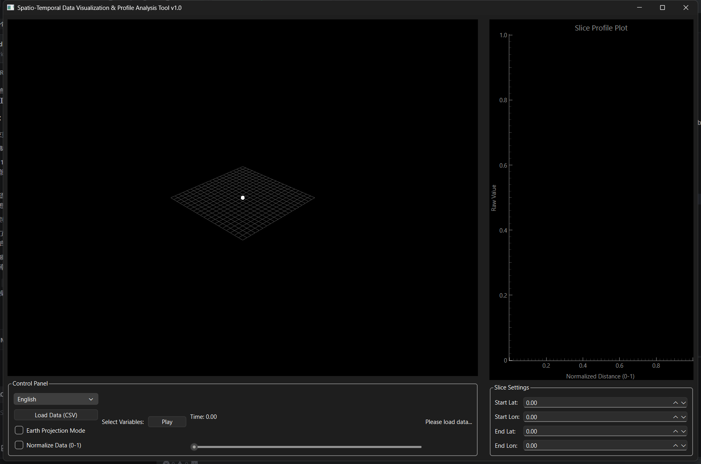
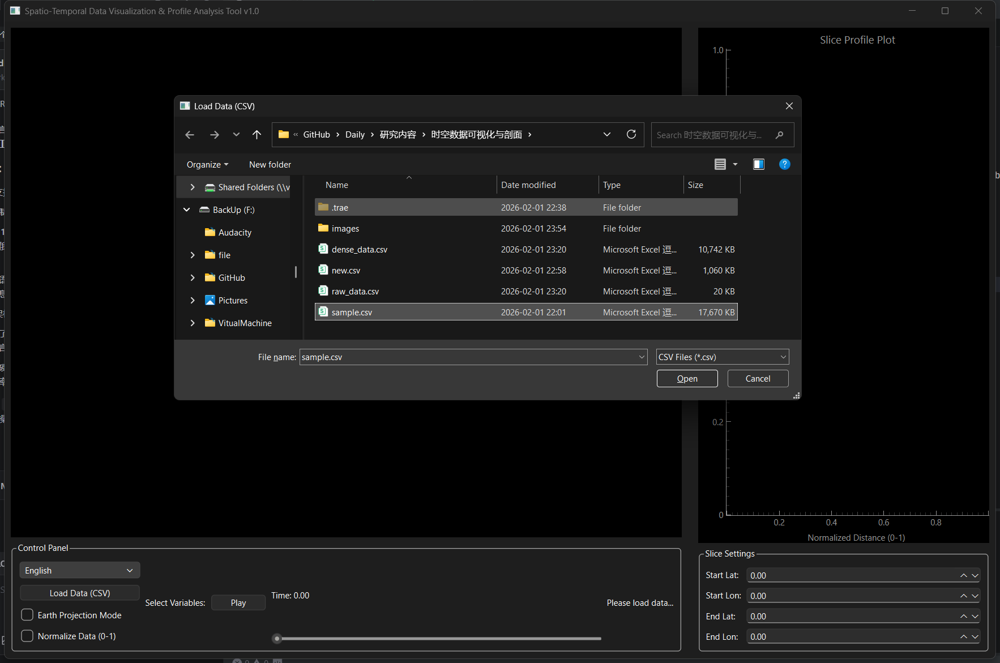
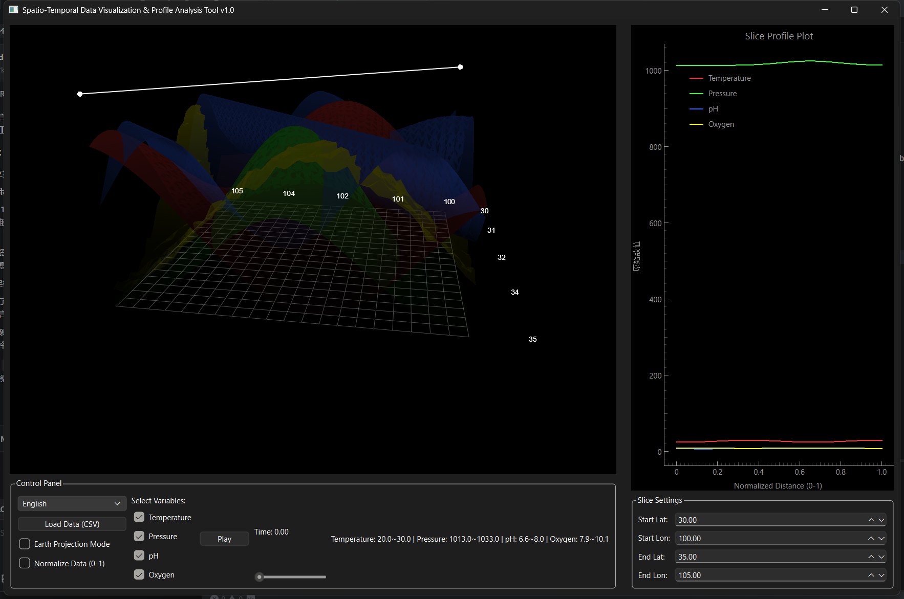
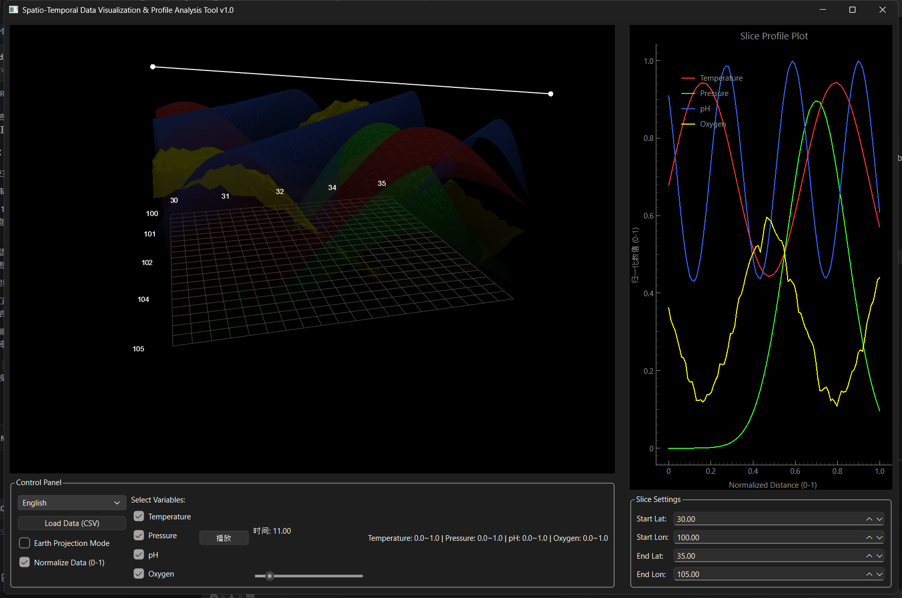
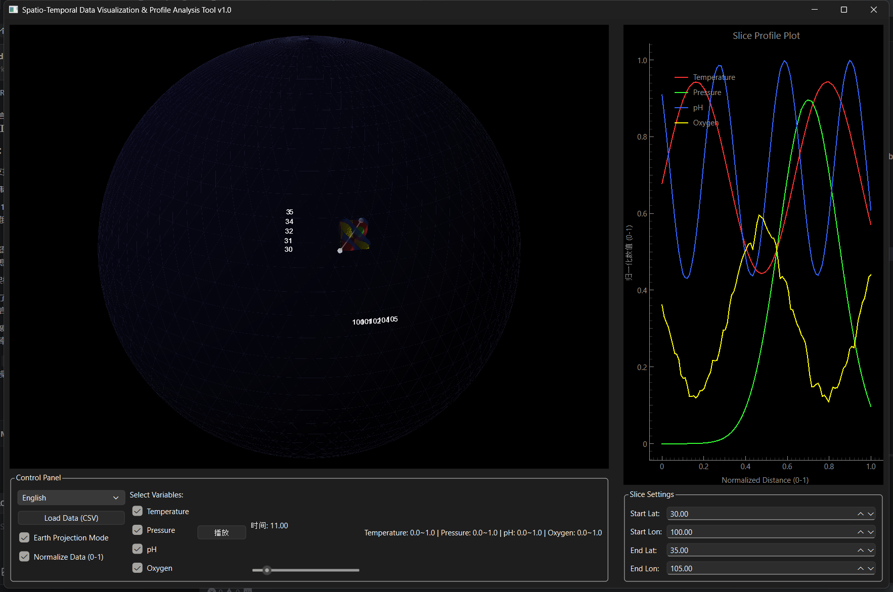

# 时空数据可视化与剖面分析工具 (Spatio-Temporal Data Visualization & Analysis Tool)

## 1. 项目背景
在地球科学、海洋学和气象学等领域，研究人员经常需要处理复杂的四维数据（经度、纬度、时间及变量）。传统的二维静态图表难以直观展示这些数据在时空跨度上的动态变化，尤其是在需要同时分析全球尺度的连续性与局部剖面特征时。此外，野外采样数据往往是稀疏且分布不规则的，直接进行可视化不仅困难，而且难以揭示潜在的规律。本项目正是为了解决这些痛点而生。它旨在提供一个轻量级、一体化的解决方案，集成了“稀疏数据插值”、“3D 交互式可视化”和“实时剖面分析”功能。通过融合先进的径向基函数（RBF）插值算法与高性能 OpenGL 渲染引擎，本工具允许研究人员瞬间将零散的观测点重构为连续的全球场，并通过交互式切片进行深度剖析，从而显著降低多维数据分析的技术门槛，提升科研效率。

## 2. 应用场景
本工具广泛适用于涉及因时空变化而产生的数据分析场景。
- **海洋科学研究**：可视化海水温度、盐度、含氧量的动态变化。研究人员可以导入来自浮标或科考船的稀疏传感器数据，重构全球海洋环境场，并通过切片分析温跃层或洋流的垂直结构。
- **地质勘探**：在地质调查中，采样点通常是有限的。本工具可以对地层信息进行空间插值，帮助地质学家在 3D 空间中直观理解地下结构和地球化学元素的分布趋势。
- **气象分析**：展示大气压、湿度和风场的演变过程。时间轴播放功能有助于气象学家观察天气系统的移动轨迹和生消过程。
- **环境监测**：追踪污染物的扩散路径。通过对比归一化后的数据，可以清晰地观察不同污染指标之间的时空相关性。
- **教育演示**：在地理或物理课堂上，“地球投影模式”为学生提供了一个直观的全球视角，帮助他们理解抽象的时空分布概念。

## 3. 兼容硬件
本应用程序针对性能进行了优化，可在多种硬件配置上流畅运行。
- **处理器 (CPU)**：推荐使用现代多核处理器（如 Intel Core i5/i7 或 AMD Ryzen 5/7 系列）。RBF 插值算法涉及大量的矩阵运算，多核 CPU 能显著加速稀疏数据的预处理过程。
- **显卡 (GPU)**：鉴于可视化核心依赖于 OpenGL，强烈建议配备独立显卡（NVIDIA GeForce GTX 1050 或 AMD Radeon RX 560 及以上级别），以确保在进行 3D 渲染、旋转和缩放时的帧率流畅。集成显卡（如 Intel UHD/Iris Xe）也能运行本程序，但在渲染高分辨率网格或复杂的球体网格时可能会出现轻微卡顿。
- **内存 (RAM)**：建议至少配备 8GB 内存。对于高分辨率网格插值（例如超过 100x200x50 的网格），建议配备 16GB 或更多内存，以存储中间矩阵数据和生成的稠密数据结构。
- **显示器**：建议使用 1080p 或更高分辨率的显示器，以便同时容纳 3D 视图、左侧控制面板和右侧剖面分析图表的布局。

## 4. 操作系统
本项目构建在跨平台的 Python 生态系统和 Qt 框架之上，确保了广泛的兼容性。
- **Windows**：完美支持 Windows 10 和 Windows 11 (64位)。这是主要的开发和测试环境，提供最佳的稳定性和性能表现。
- **macOS**：兼容 macOS Catalina (10.15) 及更新版本。同时支持 Intel 芯片和 Apple Silicon (M1/M2/M3) 芯片（通过 Rosetta 2 或原生 ARM Python 环境）。
- **Linux**：支持主流 Linux 发行版，如 Ubuntu 20.04+, Fedora, 和 CentOS。用户需确保已安装正确的显卡驱动和 OpenGL 库。推荐使用 X11 窗口系统，Wayland 用户可能需要额外的环境变量配置。
- **注意**：无论何种操作系统，都需要 Python 3.9 或更高版本的运行环境，以确保与 `requirements.txt` 中列出的依赖库兼容。

## 5. 依赖环境
本项目依赖一系列强大的开源 Python 库来实现其核心功能。
- **Python 3.9+**：基础运行环境。
- **PySide6 (Qt for Python)**：提供现代化的图形用户界面 (GUI)，包括窗口、布局、按钮和事件处理。它是 Qt 框架的官方 Python 绑定。
- **pyqtgraph**：基于 Qt 和 OpenGL 的高性能科学绘图库，在此用于 3D 地形渲染、点云显示以及 2D 图表绘制。
- **NumPy**：科学计算的基础包，用于高效的多维数组运算、坐标变换和数值计算。
- **Pandas**：强大的数据分析库，用于读取 CSV 文件、数据清洗、时间戳解析和结构化数据管理。
- **SciPy**：特别是 `scipy.interpolate` 模块，提供了径向基函数 (RBF) 插值算法 (`RBFInterpolator`)，这是将稀疏散点数据转换为规则网格的核心引擎。

## 6. 安装过程
请按照以下步骤在您的本地环境中部署本应用程序。

1.  **克隆仓库**：
    首先，将项目代码下载到您的本地计算机。
    ```bash
    git clone https://github.com/GeoPyTool/SpatioTemporalViz.git
    cd SpatioTemporalViz
    ```

2.  **创建虚拟环境（推荐）**：
    为了避免与系统库冲突，建议创建一个隔离的 Python 环境。
    ```bash
    # Windows
    python -m venv venv
    .\venv\Scripts\activate

    # macOS/Linux
    python3 -m venv venv
    source venv/bin/activate
    ```

3.  **安装依赖**：
    使用 pip 安装 `requirements.txt` 中列出的所有必需库。
    ```bash
    pip install -r requirements.txt
    ```
    *提示：如果下载速度较慢，可以使用国内镜像源（例如加上 `-i https://pypi.tuna.tsinghua.edu.cn/simple`）。*

4.  **验证安装**：
    确保所有库都已正确安装且无报错。您可以在 Python 命令行中尝试导入它们来验证。

## 7. 运行截图
### 如何运行
安装成功后，在终端中执行以下命令即可启动应用程序：
```bash
python app.py
```
主窗口应立即出现。您可以点击“加载数据 (CSV)”按钮开始使用。如果您手头没有数据，可以使用项目中提供的 `gen.py` 脚本生成一个示例 `raw_data.csv` 文件，然后加载它。程序会自动检测稀疏格式并询问是否进行插值处理。

### 截图展示
1.  **启动界面**：
    
2.  **数据加载与插值**：
    
3.  **数据可视化**：
    
4.  **数据归一化对比**：
    
5.  **地球投影模式**：
    

## 8. 授权协议
本项目是开源软件，遵循 **GNU General Public License v3.0 (GPLv3)** 授权协议。

**权限**：
- 您可以自由复制、分发和修改本软件，前提是您必须在源文件中跟踪更改/日期。
- 任何对本代码的修改或包含本代码（通过编译器）的软件，也必须在 GPL 协议下发布，并提供构建和安装说明。

**条件**：
- **源代码可用性**：您必须提供您修改后版本的完整源代码。
- **相同协议**：衍生作品必须在相同的 GPLv3 协议下发布。
- **无担保**：本软件按“原样”提供，不提供任何形式的担保。

这确保了项目对社区保持免费和开放，鼓励科学可视化领域的协作与改进。
